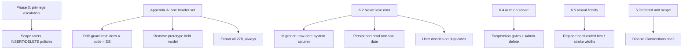

# README Alignment Refactor

README is the authority on intent. The codebase largely implements the ingest → narrow → inspect → export loop, but several load-bearing rules have drifted — especially around **preserving unrecognized import values**, **duplicate handling**, **authorization**, and **deferred/out-of-scope UI**.

---

## The model (confirmed, non-negotiable)

**One header set governs everything.** The CoStar header row — recorded verbatim in **README Appendix A** — is simultaneously:

- the `public.land_sales` columns,
- the CSV **import** template header row,
- the CSV **export** header row,
- and every field the application knows about.

All four are the same list, in the same order, with the same spelling. **278 header positions, 277 distinct names.** No header may be added, removed, renamed, reordered, aliased, or given a display synonym — anywhere, ever.

**Display never touches storage.** What appears in the results table and the record create/view/edit screens is purely the result of an Admin toggling visibility and reordering fields in settings. That configuration is presentation. **It has no bearing on the database columns, the import template, or the export file.** Hiding a field does not drop a column. Reordering does not reorder the CSV. Export always emits all 278 positions in canonical order.

**Exactly two carve-outs**, both documented in README §3A, neither a catalog field, neither ever appearing in the template, the export, or the UI:

| | What | Why |
| --- | --- | --- |
| `id` | `uuid` primary key | Row identity; `Comp ID` is not unique (many rows share `0`/null). |
| `Sprinklers` | one column, two header positions (259, 260) | Postgres cannot hold two columns of one name. |

The parallel **"core field" model** — a hand-picked subset of headers renamed to bespoke identifiers with their own types, labels, layout sheets, computed values, and `core:` ids — is a **relic of a deprecated prototype**. It is removed wholesale by this plan, not restored. After Phase 2 it must not appear anywhere: not in `lib/`, `app/`, `components/`, tests, comments, or admin descriptors.

### Verified state of the contract

Checked directly before writing this revision — all four representations already agree, byte for byte:

| Representation | Result |
| --- | --- |
| README Appendix A (canonical list) | 278 positions, 277 distinct |
| `COSTAR_HEADER_ROW` in `lib/land-sales/costar-fields.ts` | identical, order and text |
| `$costar$` list in migration `20260823015605` | identical, order and text |
| Live `land_sales` columns | 277 catalog names in canonical order, plus `id` |
| `costar-column-types.ts` vs live Postgres types | matches exactly (22 numeric, 6 bigint, 3 timestamp, 1 boolean) |

**The contract is intact today.** The work below is to make the *code* stop contradicting it, and to add the drift guard that keeps it intact.

---

## Findings

### Blocker — privilege escalation (§2, §6.4)

0. **Any authenticated user can become Admin.**
   Live policies on `public.users`:

   | cmd | policy | qual / with_check |
   |---|---|---|
   | DELETE | authenticated users can delete users | `true` |
   | INSERT | authenticated users can insert users | `true` |

   `current_user_role()` reads `public.users.role` for `auth.uid()`, and every app check plus every `land_sales` / `result_display_settings` policy depends on it. A Viewer can delete their own profile row and insert a replacement with `role = 'Admin'`. Unrestricted DELETE is independently severe — any user can wipe every profile row. `users can update own profile` is correctly scoped to `id = auth.uid()`, which is likely why this went unnoticed: the path is delete-then-reinsert, not update.

   *Verified by reading policy definitions; the escalation was not executed.*

### Critical — §6.2 Never lose the user's data

1. **Unrecognized Sale Date is not preserved after import.**
   [`validateDataRows`](lib/land-sales/csv.ts) captures the raw text and warns, but [`importLandSaleRow`](lib/land-sales/csv.ts) never writes it and overlays `'Sale Date'` with `null`. [`landSaleFromRow`](lib/land-sales/db.ts) hardcodes it to `undefined` and never reads a column. The flag UI in [`SaleDateCell`](components/land-sales/results-table.tsx) therefore cannot survive a reload. Export is affected too: `makeCsv` falls back to the raw text, so an unrecognized date round-trips as an empty cell.

   ⚠️ **There is no column to persist it into.** The live table holds only the 277 catalog columns plus `id`. The `sale_date_raw` column exists solely in migration `20260823015605`, which targets the older snake_case table superseded by `20260823220450`. **Writing this field without a migration first puts an unknown column in the insert payload, and PostgREST rejects the entire batch** — turning a warning into total import failure. Phase 1 begins with a migration.

2. **Duplicates are reported then auto-skipped.**
   [`importLandSales`](app/(app)/land-sales/actions.ts) collects `duplicates` and inserts only `fresh`, with no user decision. README: *"Likely duplicates are reported to the user, never silently skipped or silently merged. The user decides."*

3. **`Sprinklers` round-trips lossily.** *(New.)*
   `costarTextValues` walks all 278 positions writing into a column map, so positions 259 and 260 both target `Sprinklers` and **the second silently overwrites the first**. `makeCsv` then emits that single stored value into *both* positions. If a source file ever carries different values there, one is destroyed on import and the other is duplicated on export. Low likelihood, real data loss. Decide explicitly: accept and document, or take it through §5 as a contract question. **Do not silently add a column.**

### High — §3A / §6.1 One catalog, and it is the header row

4. **A second, competing field model is still wired into production.**
   A hand-picked subset of headers is mapped to bespoke snake_case identifiers with their own types, labels, detail sheets, computed fields, and `core:` visibility ids. It is inconsistently applied — the record UI already ignores the layout sheets, the admin arrangement saves only `extra:` identifiers, and the descriptor table is referenced by tests alone — so the codebase currently disagrees with itself about what a field is.

   Concentrated in: `lib/land-sales/result-columns.ts` (20 references), `field-visibility.ts`, `csv.ts`, `visible-record-input.ts`, `schema.ts`, `db.ts`, `lib/admin/database-descriptor.ts`, `components/land-sales/results-table.tsx`, plus six test files.

5. **A derived price-per-acre competes with a real catalog column.**
   The app computes its own price-per-acre while `Price Per AC Land` exists in the catalog. Two answers to one question, and the computed one is not a field.

6. **Vocabulary drift.**
   The UI labels the catalog header `Market` as "MSA" — a display synonym, forbidden by §3A. Route `/admin/database-manager/schema` and its "Edit Fields" copy describe **arrangement** (display configuration), not the deferred "live schema editing" capability, inviting the wrong change type per §8.

7. **`Comp ID` as identity fallback.**
   [`landSaleFromRow`](lib/land-sales/db.ts): `id: asString(row.id) || String(row['Comp ID'] ?? '')`. `Comp ID` is not unique. Contradicts the `id` carve-out.

8. **No drift guard exists.**
   Four representations must agree and nothing enforces it. They agree today by luck and diligence, not by construction.

### High — §2 / §6.4 Authorization

9. **Profile mutations skip the suspension check.**
   [`updateProfileAction` / `updateAvatarAction`](app/(app)/profile/actions.ts) require only a session. The `users` UPDATE policy is `id = auth.uid()` with no `current_user_active()`, so a suspended user can write their profile at both layers. README §2: suspension *"revokes write ability regardless of role."*

10. **Admin delete is documented as built, not implemented.**
    README §2 grants Admin *"delete records"*; [`canEdit`](lib/users/roles.ts) references an Admin-only delete "checked separately." No delete Server Action or UI exists. The database is already prepared — `land_sales` carries an `admins can delete land_sales` policy gated on `current_user_active() AND current_user_role() = 'Admin'`.

11. **Admin RPC gating is a consistency issue, not a hole.** *(Downgraded.)*
    `admin_set_user_role` and `admin_set_user_suspended` are `SECURITY DEFINER` and **do** verify `current_user_role() = 'Admin'`, raising otherwise; the suspension RPC also blocks self-suspension. That satisfies §6.4. Two narrower defects remain: failures surface as raw Postgres exception strings rather than typed form state, and neither RPC checks suspension, so a **suspended Admin can still change roles**.

### Medium — §5 Deferred / out of scope

12. **Connections tab is an interactive fake product surface.**
    [`DatabaseManagerTabs`](components/admin/database-manager-tabs.tsx) ships sample rows, an enabled "Add Connection" wizard, and `color: 'red'`. Its own comment records the intent — *"Illustrative only … (decided scope: UI shell)"* — and README §5 now lists it as deferred. It must render visible-but-disabled, not as a working shell that looks live.

13. Deferred search branches (Rentals/Expenses/Costs, Improved/Ground Leases) and DOCX export already follow the deferred pattern — keep them.

### Medium — §6.5 Visual fidelity

14. Widespread hard-coded hex (`#FFFFFF`, `#b3261e`, `#92400e`, `#fef3c7`, …) across filters-sidebar (16), search-client (14), import-client (13), auth, profile, results. Tokens exist in [`main.css`](styles/main.css) but error/warning roles are incomplete. Lucide icons frequently use `strokeWidth={2}`/`2.5`/`3` instead of `1.5`.

### Lower — layering / hygiene (§6.6, AGENTS)

15. [`buildSearchFilterEntries`](components/land-sales/filters-sidebar.tsx) encodes filter-entry construction in a client component; belongs in `lib/land-sales/` as a tested pure helper.
16. Stale comment in [`lib/supabase/server.ts`](lib/supabase/server.ts) says "Middleware" (means `proxy.ts`).
17. No `server-only` on server modules (AGENTS-welcomed hardening; optional, last phase).

---

## Refactor approach

Align code to the contract in README Appendix A. One catalog, one set of names, no synonyms, no subsets, no computed pseudo-fields.

### Phase 0 — Close the escalation path (blocker)

Nothing else ships until this is done.

- Replace the `users` INSERT policy: restrict to `id = auth.uid()`, and prevent a self-inserted row from choosing its own privilege (default `role` server-side, or `with_check (id = auth.uid() and role = 'Viewer')`). First confirm whether signup depends on a client-side insert or an `auth.users` trigger — if a trigger creates the row, drop the INSERT policy entirely.
- Replace the `users` DELETE policy: Admin-only (`current_user_active() and current_user_role() = 'Admin'`), or drop DELETE if the product never deletes users.
- Ship as a migration; `supabase/migrations/` has no `users` history (AGENTS §4).
- Verify: a Viewer session cannot insert or delete rows in `public.users`; signup and sign-in still work.

### Phase 1 — Data integrity (§6.2)

**Decision required — where does an unrecognized date live?** A raw-date store is not a catalog field, so it cannot be a `land_sales` header column. `id` sets the precedent for a documented carve-out. Recommended: a **system column** named to be self-evidently outside the catalog (e.g. `_sale_date_raw`), never derived from `COSTAR_HEADER_ROW`, never exported, never rendered as a field, and added to the README §3A carve-out table in the same change. Alternative, if the table must hold catalog columns only: a sidecar table keyed by `land_sales.id`. Either way the 278-position contract is untouched.

- **Migration first.** Add the chosen store with `notify pgrst, 'reload schema';`, and record it in README §3A.
- Persist the raw text on import when the date is unrecognized; keep the typed `Sale Date` null.
- Read it back so `SaleDateCell` survives a reload; carry it through export so `makeCsv` re-emits the original text and the row round-trips.
- Assert system stores never appear in `costarColumnNames()`, the import template, or the export header row.
- Change import UX: when duplicates exist, **stop and present them**; insert only after an explicit user choice (import non-duplicates / cancel). No silent skip.
- Remove the `Comp ID` identity fallback; require the uuid `id` and fail closed.
- Decide finding 3 (`Sprinklers`) explicitly and record the decision.
- Tests: raw-date persistence and re-export, duplicate gating, system-store exclusion from the catalog.

### Phase 2 — Remove the deprecated field model

The goal is a codebase where a field is a header string and nothing else. Work outward from the catalog so the type checker drives the sweep.

- **Catalog and columns.** Delete the header→identifier map and the hand-picked column list. `resultColumns()` returns catalog headers only — it already does; delete the vestigial `catalogLabels` option, its `void` discard, and `catalogLabels: []` at every call site. Collapse `ResultColumn` to a single kind and delete `core:` from the visibility-id scheme.
- **Record shape.** Replace the bespoke record type with a header-keyed map. Validation becomes per-column coercion driven by [`costarColumnType`](lib/land-sales/costar-column-types.ts), preserving §6.2's forgiving behavior. Retire `landSaleFromRow` / `landSaleToRow` as identifier translators — a row is already the record.
- **Layout.** Delete the detail sheets, sections, computed-field list, and sheet-building helpers. Record screens render the arrangement alone. `buildRecordDisplayPages` already skips everything but arrangement fields, so this removes dead branches rather than changing behavior.
- **Derived value.** Delete the computed price-per-acre; `Price Per AC Land` is the catalog answer.
- **Export.** Confirm export emits all 278 positions in canonical order regardless of visibility or arrangement, and add a test that fails if display configuration can influence the export.
- **Filters.** Primary filters already target header names — verify no bespoke identifier survives, and drop legacy URL param names that no longer carry meaning.
- **Duplicates.** Re-key `recordKey` onto headers (`Parcel Number 1 (Min)`, `Sale Date`, `Property Address`).
- **Admin descriptors.** Delete the unused descriptor table and custom-field helper outright.
- **Naming.** Label `Market` as `Market`; retire the "MSA" synonym. Rename the admin route and copy from `schema` to `arrangement` (or `fields`), headings to "Field configuration". Live schema editing stays deferred.
- **Sweep.** No occurrence of the prototype vocabulary may remain in `lib/`, `app/`, `components/`, tests, or comments. Update the six affected test files rather than dropping their coverage.

### Phase 3 — The drift guard

Small, and the thing that keeps the contract true after everyone forgets this plan.

- A test asserting `COSTAR_HEADER_ROW` is byte-identical to the fenced list in README Appendix A — 278 positions, 277 distinct, `Sprinklers` at 259 and 260.
- A check asserting the live `land_sales` columns equal the 277 catalog names in canonical order, plus exactly the documented carve-outs.
- A test asserting `costar-column-types.ts` matches the live Postgres types (currently exact: 22 numeric, 6 bigint, 3 timestamp, 1 boolean).
- Failure messages must name the offending header and say which representation drifted.

### Phase 4 — Authorization + Admin delete (§2, §6.4)

- Add shared helpers in [`lib/users/roles.ts`](lib/users/roles.ts) (e.g. `adminDeniedMessage`, `landSaleDeleteDeniedMessage` — Admin and not suspended).
- Gate profile writes on suspension, in the action **and** in the `users` UPDATE policy (add `current_user_active()`).
- Add a suspension check to both admin RPCs, and map RPC exceptions to typed form state instead of raw Postgres strings.
- Implement Admin-only `deleteLandSale` (plus bulk, since selection exists) with `logAudit` and `revalidatePath`. The DB policy already exists. UI affordance on results/detail; Viewer/Editor gating is courtesy only.
- Confirm every mutation still calls `logAudit` best-effort (never blocking).

### Phase 5 — Scope and deferred UI (§5)

- Connections: keep visible; disable "Add Connection" and row actions; `title="Coming in a later phase"`; replace the sample "live" status rows with the deferred label; remove or make unreachable the wizard.
- Do not enable live schema editing.

### Phase 6 — Design-system fidelity (§6.5)

- Add semantic tokens if missing (`--color-danger`, `--color-warning`, tint fills) to `industry.css`, mapped from the current hard-coded values.
- Replace component hex and `color: 'red'` with tokens; prefer existing `.tag` / `.record-error` classes over one-off styles.
- Normalize Lucide `strokeWidth={1.5}`.

### Phase 7 — Layering cleanup

- Move `buildSearchFilterEntries` into `lib/land-sales/` with tests.
- Fix the stale "Middleware" comment in `lib/supabase/server.ts`.
- Optionally add `server-only` to `lib/supabase/server.ts` and action modules.

---

## Documentation — already done

Completed ahead of this revision, so the plan and the docs no longer disagree:

- **README §3A "The field catalog — closed and canonical"** — one header set governs all four representations; the catalog is closed; display never touches storage; the two carve-outs; verified state.
- **README Appendix A** — the canonical 278-position header row verbatim, plus the typed-column classification. Verified byte-identical to `COSTAR_HEADER_ROW`.
- **README §3** — core-field and derived-field vocabulary deleted; a field *is* a header string.
- **README §4** — filters and record layout restated in header terms; export always emits all 278 positions.
- **README §6.1** — rewritten as "The CoStar header row *is* the schema," explicitly naming the core-field layer as deprecated prototype wreckage.
- **README §8** — extension table rows for closed-catalog changes, display-rename refusals, and partial-export refusals.
- **AGENTS.md §3.1, §3.2, §10** — Appendix A named as the contract, carve-outs tabulated, drift guard required, prototype schema flagged as removal-only, `Sprinklers` lossiness recorded as a known trap.

Remaining doc work is Phase 1's carve-out entry if a raw-date store is added.

---

## Verification (required before calling a phase done)

- `npx tsc --noEmit`
- `npx next build`
- `npm run lint`
- Phase 0: a Viewer session cannot insert or delete `public.users` rows; signup and sign-in still work.
- Phase 1: import a row with a bad Sale Date → reload results → flag still shows the raw text → re-export → raw date present in CSV → re-import cleanly.
- Phase 1: a duplicate-bearing import requires explicit confirmation before anything is inserted.
- Phase 2: repository-wide search for the prototype vocabulary returns nothing; a record edited on screen saves every field once.
- Phase 2/3: hide and reorder fields in admin settings, then export — the file still carries all 278 headers in canonical order, unchanged.
- Phase 3: mutate a header in the code constant and confirm the drift guard fails loudly.
- Phase 4: Viewer cannot delete; Admin can; a suspended user cannot write via a directly invoked action; a suspended Admin cannot change roles.

Type-check and build are the only checks that run out of the box; the `node:test` suites need a resolver shim (AGENTS §7). Write the tests regardless, and report honestly which checks actually ran.

---

## Out of this plan

- Building Rentals / Improved / DOCX / live schema editing.
- Introducing a test-runner harness (still write colocated tests; note the harness gap per README §7).
- Any change to the header row itself — that is a §5 contract decision, not refactoring work.
- Restoring, extending, or reintroducing the deprecated field model in any form.
